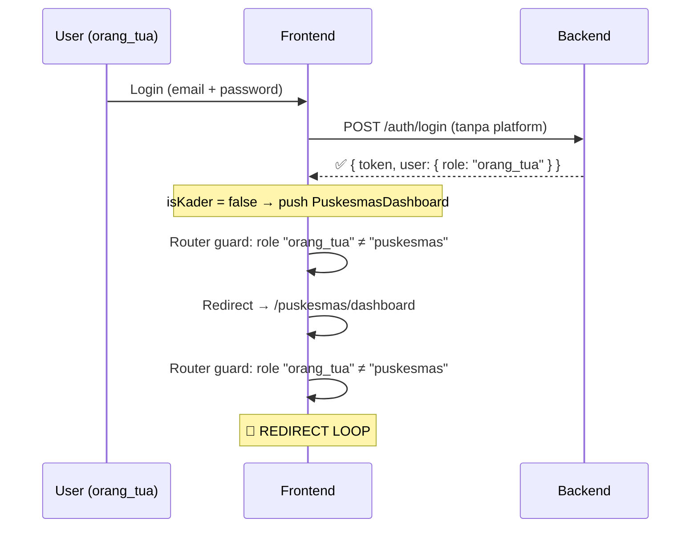
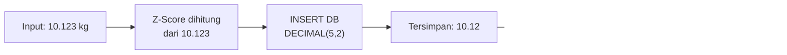
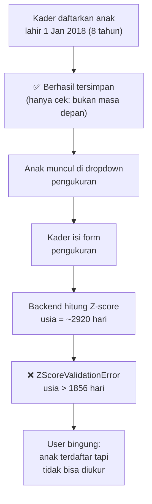

# Verifikasi Temuan Prioritas — Frontend × Backend

**Tanggal verifikasi:** 3 September 2026  
**Metode:** Inspeksi langsung pada source code

---

## Temuan 1 — 🔴 TINGGI: Akun Orang Tua Dapat Login via Web Dashboard

**Status: ✅ TERKONFIRMASI**

### Bukti

**Backend — [`authController.js`](file:///e:/Programs/project-kuliah-pui/backend-express/src/controllers/authController.js#L27):**
```javascript
// line 27
const isMobile = platform === "mobile";

// line 51-54 — Hanya membatasi NON orang_tua di MOBILE
if (isMobile && user.role !== "orang_tua") {
    return error(res, "Akses ditolak", 403);
}
```
Backend **tidak** memiliki pengecekan kebalikannya: `if (!isMobile && user.role === "orang_tua")`. Artinya request login dari web tanpa `platform: "mobile"` dari akun `orang_tua` **akan berhasil** dan mendapatkan token JWT yang valid.

**Frontend — [`LoginView.vue`](file:///e:/Programs/project-kuliah-pui/web-dashboard/src/views/auth/LoginView.vue#L54-L57):**
```javascript
// line 54-57
if (success) {
    router.push({
        name: authStore.isKader ? "KaderDashboard" : "PuskesmasDashboard",
    });
}
```
Logika ternary: `isKader` = `role === "kader"`. Jika role bukan `kader`, maka **selalu diarahkan ke `PuskesmasDashboard`** — termasuk role `orang_tua`.

**Frontend — [`router/index.js`](file:///e:/Programs/project-kuliah-pui/web-dashboard/src/router/index.js#L165-L171):**
```javascript
// line 165-171
if (to.meta.requiresGuest && auth.isLoggedIn) {
    return next(auth.isKader ? "/kader/dashboard" : "/puskesmas/dashboard");
}
if (to.meta.role && auth.role !== to.meta.role) {
    return next(auth.isKader ? "/kader/dashboard" : "/puskesmas/dashboard");
}
```
Route `/puskesmas/*` memiliki `meta.role = "puskesmas"`. Ketika `orang_tua` mencoba akses, `auth.role ("orang_tua") !== "puskesmas"` → redirect ke `/puskesmas/dashboard` → yang lagi-lagi ditolak → **redirect loop infinite**.

### Alur Kejadian



### Dampak
- UI mengalami redirect loop (halaman blank/freeze)
- Token JWT valid tetap tersimpan di localStorage
- Backend API tetap aman (role guard menolak akses data), tapi UX rusak total

### Saran Perbaikan

| Opsi | Lokasi | Perubahan |
|---|---|---|
| **A. Blok di backend** | [`authController.js:51`](file:///e:/Programs/project-kuliah-pui/backend-express/src/controllers/authController.js#L51) | Tambah: `if (!isMobile && user.role === "orang_tua") return error(...)` |
| **B. Blok di frontend** | [`LoginView.vue:54`](file:///e:/Programs/project-kuliah-pui/web-dashboard/src/views/auth/LoginView.vue#L54) | Cek role setelah login, tampilkan pesan error jika `orang_tua` |
| **C. Keduanya (recommended)** | Kedua file | Defense in depth — blok di BE + tampilkan pesan di FE |

---

## Temuan 2 — 🟡 MENENGAH: Validasi KG/CM Frontend Tidak Sama dengan Backend

**Status: ✅ TERKONFIRMASI**

### Bukti Perbandingan

| Field | HTML `min` attr | HTML `max` attr | JS validation (`fieldError`) | Backend schema ([`schemas.js:90-98`](file:///e:/Programs/project-kuliah-pui/backend-express/src/validation/schemas.js#L90-L98)) |
|---|---|---|---|---|
| `berat_badan` | `0.5` | `30` | `> 0 && <= 30` | `min: 0.01, max: 30` |
| `tinggi_badan` | `10` | `120` | `> 0 && <= 120` | `min: 0.01, max: 120` |
| `lingkar_kepala` | `10` | `60` | ❌ Tidak ada | `min: 1, max: 80` |
| `lingkar_lengan` | `5` | `30` | ❌ Tidak ada | `min: 1, max: 60` |

**Detail kode:**

Form tag menggunakan `novalidate` ([`PengukuranView.vue:59`](file:///e:/Programs/project-kuliah-pui/web-dashboard/src/views/kader/PengukuranView.vue#L59)):
```html
<form novalidate class="space-y-4" @submit.prevent="handleSubmit">
```
Ini membuat atribut HTML `min`/`max`/`step` **tidak di-enforce** oleh browser.

JS validation ([`PengukuranView.vue:328-341`](file:///e:/Programs/project-kuliah-pui/web-dashboard/src/views/kader/PengukuranView.vue#L328-L341)):
```javascript
const fieldError = computed(() => {
    const e = {};
    if (form.berat_badan !== null && (form.berat_badan <= 0 || form.berat_badan > 30))
        e.berat_badan = "Berat badan harus antara 0–30 kg";
    if (form.tinggi_badan !== null && (form.tinggi_badan <= 0 || form.tinggi_badan > 120))
        e.tinggi_badan = "Tinggi badan harus antara 0–120 cm";
    return e;
    // ❌ Tidak ada validasi lingkar_kepala dan lingkar_lengan
});
```

### Skenario Masalah

| Skenario | Frontend | Backend |
|---|---|---|
| BB = 0.005 kg | ✅ Lolos (> 0) | ✅ Lolos (≥ 0.01) |
| BB = 0.001 kg | ✅ Lolos (> 0) | ❌ Ditolak (< 0.01) |
| Lingkar kepala = 75 cm | ✅ Lolos (tidak divalidasi) | ✅ Lolos (≤ 80) |
| Lingkar lengan = 55 cm | ✅ Lolos (tidak divalidasi) | ✅ Lolos (≤ 60) |
| Lingkar kepala = 85 cm | ✅ Lolos (tidak divalidasi) | ❌ Ditolak (> 80) |

### Dampak
- User bisa mengisi nilai yang frontend izinkan tapi backend tolak → error toast tanpa feedback field yang jelas
- Tidak ada UX error inline untuk lingkar kepala/lengan di luar range
- Batas minimum di frontend lebih ketat untuk BB (implisit, HTML hint saja) tapi tidak ditegakkan

---

## Temuan 3 — 🟡 MENENGAH: Presisi Pengukuran Berubah Setelah Disimpan

**Status: ✅ TERKONFIRMASI**

### Alur Data



**Bukti:**

1. **Create endpoint** — [`pengukuranController.js:71-77`](file:///e:/Programs/project-kuliah-pui/backend-express/src/controllers/pengukuranController.js#L71-L77):
   ```javascript
   // Z-score dihitung dari `berat` (nilai request asli, bukan dari DB)
   const zscores = zscoreService.hitungSemuaZScore({
       berat_badan: berat,    // ← 10.123 (asli dari request)
       tinggi_badan: tinggi,  // ← dari request
       ...
   });
   ```

2. **Insert DB** — [`pengukuranController.js:89-97`](file:///e:/Programs/project-kuliah-pui/backend-express/src/controllers/pengukuranController.js#L89-L97):
   ```javascript
   await PengukuranModel.createPengukuran({
       berat_badan: berat,   // 10.123 → DECIMAL(5,2) → 10.12
       tinggi_badan: tinggi,
       ...
   });
   ```

3. **Schema SQL** — [`schema.sql:86-87`](file:///e:/Programs/project-kuliah-pui/backend-express/src/database/schema.sql#L86-L87):
   ```sql
   berat_badan DECIMAL(5,2) NOT NULL,  -- pembulatan otomatis
   tinggi_badan DECIMAL(5,2) NOT NULL,
   ```

4. **Read endpoint** — [`pengukuranService.js:137-144`](file:///e:/Programs/project-kuliah-pui/backend-express/src/services/pengukuranService.js#L137-L144):
   ```javascript
   export const enrichPengukuran = (raw, anak) => {
       const zscores = zscoreService.hitungSemuaZScore({
           berat_badan: parseFloat(raw.berat_badan),  // ← 10.12 (dari DB, sudah dibulatkan)
           ...
       });
   ```

### Contoh Dampak

| Aspek | Saat Create | Saat Riwayat/Detail |
|---|---|---|
| Input | `10.123 kg` | — |
| Nilai Z-score | Dihitung dari `10.123` | Dihitung ulang dari `10.12` |
| Perbedaan | — | Z-score sedikit berbeda |

### Dampak
- Dampak numerik sangat kecil (orde 0.001-0.01 pada Z-score) — **tidak mengubah kategori status gizi** dalam praktik
- Namun secara teknis, response pertama (create) bisa menampilkan Z-score yang sedikit berbeda dari response riwayat/detail

### Saran Perbaikan
- Bulatkan ke 2 desimal **sebelum** hitung Z-score di create endpoint, atau
- Ubah kolom DB ke `DECIMAL(6,3)` agar presisi input dipertahankan, atau
- Tambahkan `step="0.01"` di form dan batasi input ke 2 desimal

---

## Temuan 4 — 🟡 MENENGAH: Search & Filter Hanya pada Halaman Pagination Aktif

**Status: ✅ TERKONFIRMASI**

### Bukti

**[`AnakView.vue:386-398`](file:///e:/Programs/project-kuliah-pui/web-dashboard/src/views/kader/AnakView.vue#L386-L398):**
```javascript
const filteredList = computed(() => {
    let list = kaderStore.anakList;  // ← Data halaman aktif saja (1 page)
    if (filterJK.value !== "semua")
        list = list.filter((a) => a.jenis_kelamin === filterJK.value);
    const q = search.value.toLowerCase().trim();
    if (q)
        list = list.filter(
            (a) =>
                a.nama.toLowerCase().includes(q) ||
                a.nama_orang_tua?.toLowerCase().includes(q),
        );
    return list;
});
```

**[`RankingView.vue:278-299`](file:///e:/Programs/project-kuliah-pui/web-dashboard/src/views/kader/RankingView.vue#L278-L299):**
```javascript
const filteredRanking = computed(() => {
    let list = pengukuranStore.rankingAnak || [];  // ← 1 page data
    if (searchQuery.value.trim()) {
        const query = searchQuery.value.toLowerCase().trim();
        list = list.filter(
            (item) =>
                item.nama_anak.toLowerCase().includes(query) ||
                item.nama_orang_tua.toLowerCase().includes(query),
        );
    }
    ...
});
```

**[`OrangTuaView.vue:332-341`](file:///e:/Programs/project-kuliah-pui/web-dashboard/src/views/kader/OrangTuaView.vue#L332-L341):**
```javascript
const filteredList = computed(() => {
    const q = search.value.toLowerCase().trim();
    if (!q) return kaderStore.orangTuaList;  // ← 1 page data
    return kaderStore.orangTuaList.filter(
        (ot) =>
            ot.nama_lengkap.toLowerCase().includes(q) ||
            ot.nik.includes(q) ||
            ot.alamat?.toLowerCase().includes(q),
    );
});
```

**Backend — Tidak ada endpoint search:**
```bash
# Grep di seluruh backend models — tidak ditemukan operator LIKE
$ grep -r "LIKE" backend-express/src/models/
# (kosong — 0 hasil)
```

### Dampak
- Jika ada 100 anak dan ditampilkan 20 per halaman, pencarian "Ahmad" hanya mencari di 20 anak halaman aktif
- Anak bernama "Ahmad" yang ada di halaman 3 tidak akan muncul
- User bisa salah mengira data tidak ada, padahal ada di halaman lain

### Saran Perbaikan
- **Opsi A (Server-side search):** Tambahkan query parameter `?search=...` di endpoint backend, implementasikan `WHERE nama LIKE ?` di model
- **Opsi B (Fetch all for search):** Saat user mengetik di search, fetch tanpa pagination lalu filter client-side (hanya cocok untuk dataset kecil)

---

## Temuan 5 — 🟡 MENENGAH: Anak di Luar Umur Balita Bisa Didaftarkan tapi Tidak Bisa Diukur

**Status: ✅ TERKONFIRMASI**

### Bukti

**Registrasi anak — [`schemas.js:71-79`](file:///e:/Programs/project-kuliah-pui/backend-express/src/validation/schemas.js#L71-L79):**
```javascript
export const anakCreateSchema = {
    fields: {
        ...
        tanggal_lahir: rules.date({ allowFuture: false }),  // ← Hanya cek tidak masa depan
        ...
    },
};
```
Tidak ada validasi batas usia atas (misalnya ≤ 5 tahun).

**Z-score calculation — [`zscoreService.js:243-248`](file:///e:/Programs/project-kuliah-pui/backend-express/src/services/zscoreService.js#L243-L248):**
```javascript
const maxUsiaHari = WHO[`wfa_${gender}`]?.at(-1)?.day;  // 1856 hari ≈ 5 tahun 1 bulan
if (!Number.isInteger(maxUsiaHari) || usia_hari > maxUsiaHari) {
    throw new ZScoreValidationError(
        "Usia anak di luar rentang WHO yang didukung (0-1856 hari)",
    );
}
```

**Dropdown anak di form pengukuran — [`PengukuranView.vue:83-89`](file:///e:/Programs/project-kuliah-pui/web-dashboard/src/views/kader/PengukuranView.vue#L83-L89):**
```html
<option v-for="anak in kaderStore.anakOptions" :key="anak.id" :value="anak.id">
    {{ anak.nama }} — {{ anak.nama_orang_tua }}
</option>
```
Semua anak muncul di dropdown tanpa filter usia.

### Alur Masalah



### Dampak
- Kader bisa mendaftarkan anak yang sudah bukan balita (misalnya usia 8 tahun)
- Anak tersebut muncul di semua daftar dan dropdown
- Ketika diukur, backend menolak dengan error "Usia anak di luar rentang WHO"
- Pengalaman pengguna membingungkan — tidak ada indikasi sebelumnya bahwa anak ini di luar cakupan

### Saran Perbaikan
- **Opsi A:** Tambahkan validasi usia saat registrasi anak (`tanggal_lahir` harus ≤ 5 tahun lalu)
- **Opsi B:** Filter anak di dropdown pengukuran — hanya tampilkan yang usianya dalam rentang WHO
- **Opsi C:** Tampilkan badge/warning di daftar anak jika usia di luar rentang balita

---

## Ringkasan Verifikasi

| # | Temuan | Prioritas | Status |
|---|---|---|---|
| 1 | Login orang_tua di web → redirect loop | 🔴 Tinggi | ✅ Terkonfirmasi |
| 2 | Batas validasi FE ≠ BE untuk pengukuran | 🟡 Menengah | ✅ Terkonfirmasi |
| 3 | Presisi DECIMAL(5,2) mengubah Z-score | 🟡 Menengah | ✅ Terkonfirmasi |
| 4 | Search/filter hanya 1 halaman pagination | 🟡 Menengah | ✅ Terkonfirmasi |
| 5 | Anak non-balita bisa daftar, gagal diukur | 🟡 Menengah | ✅ Terkonfirmasi |

> [!IMPORTANT]
> **Semua 5 temuan terkonfirmasi valid** setelah diperiksa langsung pada source code. Temuan #1 (redirect loop) adalah yang paling mendesak karena mengakibatkan UI tidak dapat digunakan sama sekali oleh akun orang_tua yang login via web.
