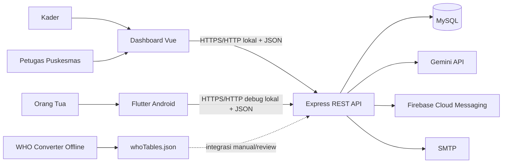

# Arsitektur

Dokumen ini menjelaskan batas komponen dan aliran data Tumbuh Posyandu. Scope aktif adalah local-first, Web + Android, database MySQL fresh, dan satu instance backend.

## 1. Konteks sistem



Backend adalah trust boundary utama. Dashboard dan mobile tidak menentukan hak akses hanya dari tampilan; API memverifikasi token, role, status akun, dan kepemilikan resource.

## 2. Komponen

| Komponen | Tanggung jawab | Tidak menjadi tanggung jawab |
|---|---|---|
| `web-dashboard/` | UI kader/puskesmas, validasi interaksi, visualisasi, download laporan | Otorisasi akhir dan perhitungan domain |
| `tumbuhapp/` | UI orang tua, penyimpanan token aman mobile, notifikasi, konsumsi kontrak aman | Menampilkan data teknis internal atau menghitung Z-score/SAW |
| `backend-express/` | API, auth/ownership, domain, laporan, integrasi eksternal, worker | Hosting production dan orchestration multi-instance |
| MySQL | Persistensi akun, master, layanan, sesi, chat, insight, notifikasi | Menyimpan Z-score/SAW deterministik sebagai kolom permanen |
| `who-converter/` | Mengubah 10 tabel Excel WHO menjadi JSON terverifikasi | Menyalin output otomatis ke backend |

## 3. Alur autentikasi

- Web mengirim platform Web dan Turnstile; hanya kader/puskesmas yang diterima.
- Android mengirim platform mobile; hanya orang tua yang diterima dan tidak memakai Turnstile.
- Backend mengeluarkan access token sesuai kontrak. Android juga memakai refresh token yang dirotasi; Web saat ini menyimpan bearer token di `localStorage` khusus scope lokal.
- Perubahan/reset password dan logout mencabut sesi sesuai aturan backend.

Detail kontrol berada di [Security dan Privacy](./SECURITY_AND_PRIVACY.md).

## 4. Pengukuran dan prioritas

```text
Input pengukuran kader
  → validasi anak, tanggal, dan nilai fisik
  → simpan data mentah pengukuran
  → hitung usia dan Z-score dari referensi WHO
  → klasifikasikan empat indeks antropometri
  → hitung skor/kategori SAW
  → gabungkan dengan minimum antropometri
  → hasilkan prioritas pemantauan
  → sajikan kontrak teknis atau kontrak aman orang tua
```

Tiga hasil tidak boleh dicampur:

1. kategori antropometri berasal dari perhitungan LMS WHO;
2. SAW memeringkat risiko kekurangan gizi dari empat Z-score;
3. prioritas pemantauan mengambil tingkat tertinggi dari SAW dan minimum antropometri.

Z-score, detail SAW, dan alasan internal tersedia untuk petugas sesuai endpoint. Orang tua menerima nilai fisik, kategori, dan status pemantauan yang sudah dipetakan tanpa detail teknis tersebut.

## 5. Insight dan chat AI

Setelah pengukuran dibuat, insight masuk status antrean. Worker mengambil pekerjaan yang tersedia, memanggil Gemini dengan konteks minimum, lalu menyimpan hasil atau status kegagalan/retry. Pengukuran lama dapat ditandai `superseded` agar insight usang tidak diproses sebagai hasil terbaru.

Chat dibatasi per pengukuran. `client_message_id` memberi idempotensi, sedangkan reservasi request mencegah dua balasan untuk pesan yang sama. Guardrail menyaring PII, prompt injection, diagnosis, resep/dosis, dan keputusan rujukan. AI hanya menyediakan edukasi umum.

## 6. Rujukan, laporan, dan notifikasi

- Kader membuat rujukan berdasarkan penilaian; prioritas tinggi tidak membuat rujukan otomatis.
- Puskesmas mengubah lifecycle `diajukan → ditangani → selesai` dan menambahkan catatan tindak lanjut.
- Laporan dibuat backend agar data dan matriks akses konsisten; orang tua hanya dapat mengunduh laporan miliknya.
- Event tertentu membuat notifikasi database dan notification outbox. Worker mencoba mengirim push FCM; inbox aplikasi tidak bergantung pada payload push sebagai sumber data utama.

## 7. Proses latar belakang

Satu proses `app.js` menjalankan API sekaligus:

- notification outbox setiap 30 detik;
- cleanup refresh token pada startup dan setiap 6 jam;
- insight worker pada interval konfigurasi service.

Desain ini sederhana untuk single-instance lokal. Multi-instance memerlukan queue/lock/store rate limit tersentralisasi agar pekerjaan tidak diproses ganda dan limit konsisten.

## 8. Batas arsitektur saat ini

- belum ada migration framework dan schema version history lengkap;
- belum ada deployment topology, load balancer, atau reverse proxy yang dibekukan;
- integrasi SMTP, Turnstile, Gemini, Firebase, dan MySQL nyata belum mendapat staging E2E terpadu;
- belum ada audit trail perubahan operasional/klinis lengkap;
- iOS bukan target aktif;
- tool WHO memakai trusted offline input dan integrasinya dilakukan manual.

Keputusan serta risiko finalisasi berada di [Known Issues](./release/KNOWN_ISSUES.md).

