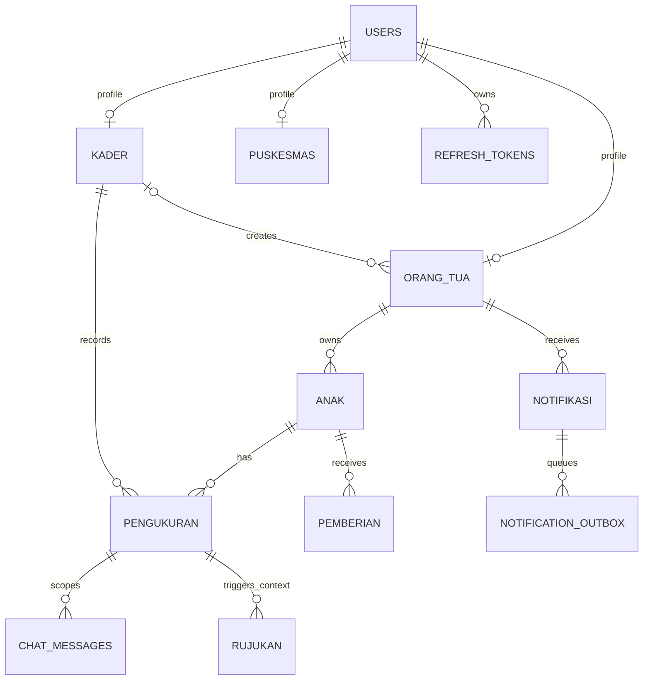

# Database

Tumbuh Posyandu menggunakan MySQL sebagai penyimpanan utama. Scope final saat ini mendukung database fresh; repository belum memiliki migration framework dan schema history lengkap untuk upgrade database existing.

## 1. Sumber schema

- Schema aktif: `backend-express/src/database/schema.sql`
- Seeder aktif: `backend-express/src/database/seeder/seeder.sql`
- Generator fixture: `backend-express/src/database/seeder/generate-seeder.js`
- Setup fresh: `backend-express/src/database/setup-database.js`

Semua tabel memakai InnoDB dan charset `utf8mb4`.

## 2. Model relasi utama



## 3. Tabel

| Tabel | Isi utama | Catatan integritas |
|---|---|---|
| `users` | Email, password hash, role, status akun | Email unik; role `kader`, `puskesmas`, `orang_tua` |
| `kader` | Profil kader | Satu profil per user |
| `puskesmas` | Profil petugas puskesmas | Satu profil per user |
| `orang_tua` | Profil wali dan FCM token | NIK unik; terhubung ke pembuat kader bila ada |
| `anak` | Identitas anak dan wali | NIK unik; dimiliki satu orang tua |
| `pengukuran` | Nilai fisik dan lifecycle insight | Unik per anak/tanggal; Z-score/SAW dihitung di application layer |
| `chat_messages` | Pesan orang tua dan balasan assistant | Idempotensi client message, satu reply, metadata role tervalidasi |
| `pemberian` | Vitamin, obat cacing, PMT | Unik per anak/jenis/tanggal |
| `rujukan` | Rujukan dari pengukuran | Status `diajukan`, `ditangani`, `selesai` |
| `pengaturan_jadwal` | Template jadwal default | Maksimal satu row melalui singleton key |
| `jadwal_posyandu` | Jadwal aktual | Tanggal unik |
| `notifikasi` | Inbox orang tua | Referensi event dapat menjadi `NULL` bila event dihapus |
| `refresh_tokens` | Hash refresh token Android | Token mentah tidak disimpan; mendukung multi-device |
| `notification_outbox` | Antrean pengiriman FCM | Status/retry/available time untuk worker |

## 4. Data tersimpan dan hasil turunan

`pengukuran` menyimpan data fisik mentah. Usia, nilai IMT, Z-score, kategori antropometri, skor SAW, dan prioritas pemantauan dihitung oleh backend ketika dibutuhkan agar rumus tetap mempunyai satu sumber implementasi.

`insight_teks` disimpan karena merupakan output AI non-deterministik. Status, attempt, lease/retry time, model, dan error ringkas juga disimpan untuk worker.

## 5. Setup dan reset fixture

```powershell
Set-Location backend-express
Copy-Item .env.example .env
npm ci
npm run db:setup
```

`db:setup`:

1. memvalidasi konfigurasi database;
2. membuat database bila belum ada;
3. menjalankan schema dengan `CREATE TABLE IF NOT EXISTS`;
4. menjalankan seeder yang me-reset tabel dan memasukkan data sintetis.

Untuk schema yang sudah cocok dan hanya perlu reset fixture:

```powershell
npm run seed:run
```

Untuk menghasilkan ulang SQL fixture:

```powershell
npm run seed:generate
npm run seed:run
```

Review diff `seeder.sql` sebelum commit hasil generator.

## 6. Penghapusan dan foreign key

Foreign key menggunakan kombinasi `CASCADE` dan `SET NULL` sesuai relasi. Di atas aturan database, service/model menerapkan guard agar orang tua atau anak dengan riwayat penting tidak terhapus tanpa sengaja. Penghapusan database atau reset seeder tetap bersifat destruktif dan hanya boleh dilakukan pada fixture lokal.

Koreksi data dilakukan melalui UI/API role yang berwenang. Jangan mengedit hasil turunan secara manual; perbaiki input pengukuran lalu biarkan backend menghitung ulang.

## 7. Script migrasi terbatas

Repository memiliki tiga script perubahan existing database:

| Command | Tujuan |
|---|---|
| `npm run db:migrate:chat-reservation` | Metadata reservasi/idempotensi chat |
| `npm run db:migrate:insight-superseded` | Status insight `superseded` |
| `npm run db:migrate:rujukan-lifecycle` | Lifecycle dan timestamp rujukan |

Script tersebut bukan migration framework umum, tidak menyediakan urutan/version table lengkap, dan tidak menggantikan backup. Untuk finalisasi lokal gunakan database fresh. Sebelum memakai database existing atau data nyata, siapkan migration runner, backup terenkripsi, dan restore drill.

Lihat [Configuration](./CONFIGURATION.md) untuk koneksi dan [Security dan Privacy](./SECURITY_AND_PRIVACY.md) untuk retensi serta batas data.

